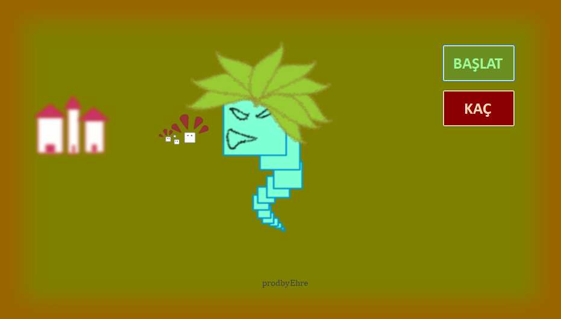
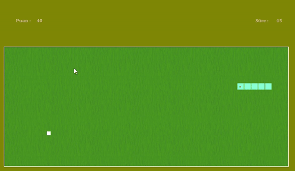

# Yilan Oyunu - C# Windows App Uygulaması

## Herkese Selamlar

Bu proje, C#'a başladığım zaman yapmış olduğum ilk projelerden birisi. 
Bu projeyi yapmamdaki amaç; C# dilini öğrenmeye yeni başlamış birisi olarak, 'Windows App' uygulaması yaparken nelerle karşılaşabileceğimi kolay bir uygulama ile görmekti.

Klayve inputlarını ve child objeleri kullanmayı denemek istemem sonucu böyle bir uygulama ortaya çıktı.

## İçindekiler

0. [Herkese Selamlar](#herkese-selamlar)
1. [Uygulama Hakkında](#uygulama-hakkında)
2. [Youtube Linki](#youtube-linki)

## Uygulama Hakkında

Oyun, uygulamanın **BAŞLAT** butonuna tıklandığı zaman başlar. W/A/S/D ile yılan hareket ettirilir ve yılan kendisine çarptığı zaman oyun biter.

Yılan hareketi hakkında kısa bir görüntü:

## Youtube Linki

Youtube üzerinden paylaştığım uygulama videosuna [bu linkten](https://youtu.be/zLFxGZQWq6c) ulaşabilirsiniz.
